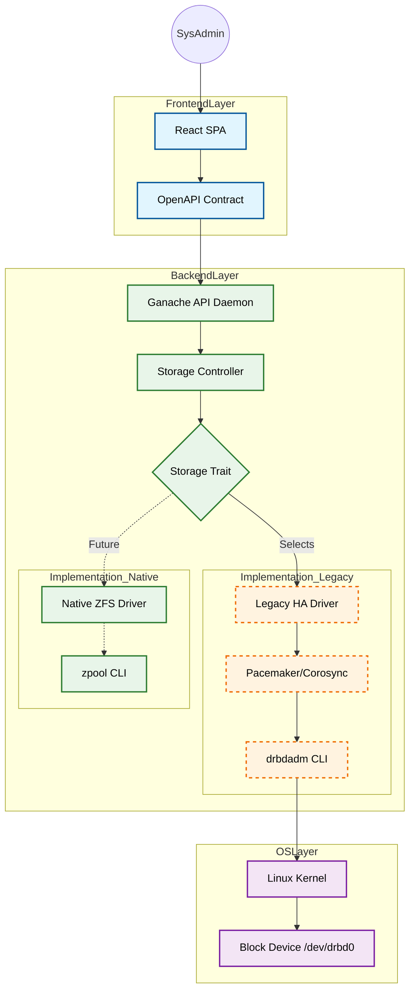

# Architecture Document: Project Ganache

**Status:** DRAFT | **Version:** 1.0 | **Date:** 2025-12-13
**Author:** Winston (Architect Agent) & Helton (Lead Engineer)

## 1. Visão Geral do Sistema

### 1.1 O que é o Ganache?

O **Ganache** é uma plataforma de armazenamento (NAS) Enterprise baseada em **Debian 12** e no núcleo do **Proxmox Backup Server (Rust)**.
Diferente de um NAS genérico, ele é projetado para operar em **Hardware Legado de Alta Disponibilidade** (especificamente controladoras RAID antigas que impedem o uso de ZFS nativo), utilizando uma camada de abstração de software para garantir integridade de dados.

### 1.2 Princípios de Design

1. **Safety First:** O sistema prioriza a integridade dos dados (ZFS/DRBD) sobre a performance bruta.
2. **Frontend-First:** A interface (React) é desenvolvida contra um contrato (OpenAPI) antes da implementação do backend.
3. **Strategy Pattern:** O sistema suporta múltiplos drivers de armazenamento (Legacy vs. Modern) sem alterar a API pública.

---

## 2. Decisões de Arquitetura (ADRs)

### ADR-001: Backend em Rust (Proxmox Fork)

* **Decisão:** Utilizar Rust e o ecossistema `proxmox-backup` como base.
* **Motivo:** Segurança de memória, performance e tipagem estrita para lógica crítica de cluster.
* **Consequência:** A curva de aprendizado é maior, mas eliminamos classes inteiras de bugs de runtime.

### ADR-002: Abstração de Armazenamento (Strategy Pattern)

* **Contexto:** O hardware alvo inicial (Dell 2950/PERC 6i) não suporta HBA/JBOD, impedindo ZFS nativo.
* **Decisão:** Criar uma `StorageTrait` em Rust com duas implementações:
    1. **LegacyHA (Default):** Orquestra DRBD 9 + Pacemaker + ZFS (sobre `/dev/drbd0`).
    2. **NativeZFS (Future):** Stub para `zpool` direto em hardware moderno.
* **Benefício:** Permite instalar o Ganache em hardware legado hoje e migrar para hardware moderno no futuro sem reescrever o Frontend ou a API.

### ADR-003: Integração "TrueNAS-Like"

* **Decisão:** Mimetizar a lógica de configuração SMB/NFS do TrueNAS Scale.
* **Implementação:** O backend Rust deve aplicar as flags `vfs objects = acl_xattr`, `map acl inherit = yes` para garantir compatibilidade total com ACLs Windows, conforme engenharia reversa do `smb.py` do TrueNAS.

---

## 3. Diagrama de Containers (C4 Level 2)



---

## 4. Estrutura de Pastas (Monorepo)

```text
/
├── .github/                   # CI/CD Workflows
├── api-spec/                  # A Verdade Única (Single Source of Truth)
│   └── openapi.json           # Especificação Swagger gerada manualmente ou via código
├── ganache-web/               # Frontend (React + Vite)
│   ├── src/
│   │   ├── api-client/        # Gerado automaticamente do openapi.json
│   │   └── components/        # Design System
├── ganache-server/            # Backend (Rust - Workspace)
│   ├── Cargo.toml
│   ├── src/
│   │   ├── api/               # Rotas Axum/Hyper (Implementam OpenAPI)
│   │   ├── config/            # Parsers de config (Samba, Network)
│   │   └── storage/           # Core Logic
│   │       ├── mod.rs         # Define a "StorageTrait"
│   │       ├── legacy_ha.rs   # Impl: DRBD + Pacemaker logic
│   │       └── native_zfs.rs  # Impl: Native ZFS logic
│   └── tools/                 # CLI tools (ganache-cli)
└── debian/                    # Empacotamento .deb e ISO scripts
```
