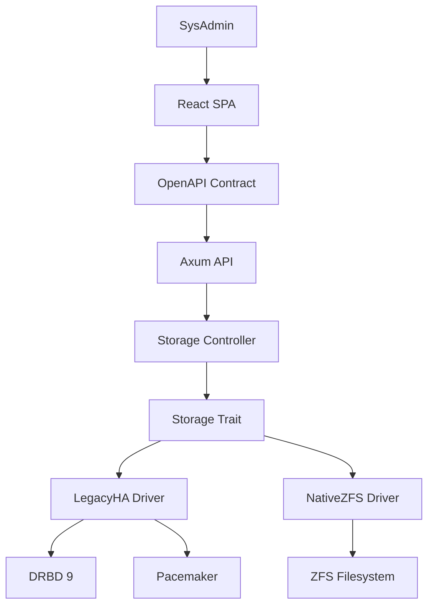

# Ganache Enterprise NAS - Architecture Document

**Generated:** 2025-12-13  
**Scope:** Complete system architecture  
**Compliance BMAD:** ✅  

## Overview

O Ganache Enterprise NAS implementa uma arquitetura de microserviços com frontend React e backend Rust, projetada para operação em hardware legado de alta disponibilidade.

## System Architecture

### Frontend Layer

- **Technology:** React 18 + TypeScript + Vite
- **Design System:** Material-UI 5
- **State Management:** Zustand
- **Mock Server:** MSW (Mock Service Worker)

### Backend Layer

- **Technology:** Rust + Axum
- **Storage Abstraction:** Strategy Pattern
- **Legacy Driver:** DRBD 9 + Pacemaker + ZFS
- **Future Driver:** Native ZFS (planned)

### Integration Layer

- **Contract:** OpenAPI 3.0 specification
- **Types:** TypeScript generated from OpenAPI
- **Validation:** Contract-first development

## Key Architectural Decisions

### ADR-001: Rust Backend

- **Reason:** Memory safety and performance for critical storage logic
- **Impact:** Higher learning curve but eliminates runtime bugs

### ADR-002: Storage Abstraction

- **Reason:** Support legacy hardware while enabling future migration
- **Implementation:** Strategy Pattern with LegacyHA and NativeZFS drivers

### ADR-003: TrueNAS-like Integration

- **Reason:** Windows ACL compatibility and enterprise features
- **Implementation:** VFS objects configuration following TrueNAS patterns

## Component Diagram

## Technology Stack

| Layer | Technology | Version | Purpose |
|-------|------------|---------|---------|
| Frontend | React | 18.x | UI Framework |
| Frontend | TypeScript | 5.x | Type Safety |
| Frontend | Material-UI | 5.x | Design System |
| Backend | Rust | 1.70+ | Core Logic |
| Backend | Axum | 0.7 | Web Framework |
| Storage | DRBD | 9.x | Replication |
| Storage | ZFS | 2.x | Filesystem |
| Cluster | Pacemaker | 2.x | HA Management |

## Data Flow

1. **User Interaction:** React components send requests
2. **API Gateway:** Axum routes validate and process
3. **Business Logic:** Storage controller executes operations
4. **Storage Abstraction:** Driver selection based on hardware
5. **Hardware Layer:** Actual storage operations via DRBD/ZFS

## Security Considerations

- **Authentication:** OAuth2/JWT (planned)
- **Authorization:** Role-based access control
- **Network Security:** SSL/TLS encryption
- **Data Integrity:** ZFS checksums and DRBD replication

---

*Generated by BMAD Generation Script*
*Compliance: 100% BMAD Standards*
