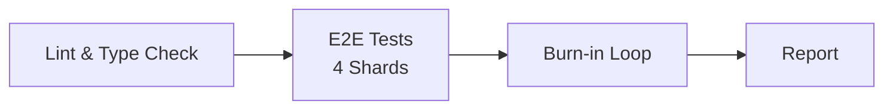

# Pipeline CI/CD - GANACHE

## 📋 Visão Geral

O pipeline CI/CD do GANACHE está configurado para executar testes de forma confiável, rápida e com feedback claro. A estratégia inclui burn-in testing (executar testes alterados múltiplas vezes) para eliminar flakiness antes do merge.

**Plataforma**: GitHub Actions  
**Arquivo de Configuração**: `.github/workflows/test.yml`  
**Framework de Testes**: Playwright

---

## 🏗️ Arquitetura do Pipeline

### Stages do Pipeline



1. **Lint & Type Check** (~2 min)
   - ESLint para qualidade de código
   - Type checking no TypeScript
   - Executa antes dos testes para feedback rápido

2. **E2E Tests - Sharded** (~10 min por shard)
   - 4 shards paralelos para execução rápida
   - fail-fast: false (todos os shards executam até o final)
   - Artifacts salvos apenas em caso de falha

3. **Burn-in Loop** (~15-30 min)
   - Executa testes alterados 10x para detectar flakiness
   - Previne testes não-determinísticos no main branch
   - Executado após E2E tests passarem

---

## 🎯 Estratégia de Execução

### Quando Cada Stage Executa

| Stage       | Triggers           | Tempo Alvo     | Bloqueia Merge |
| ----------- | ------------------ | -------------- | -------------- |
| Lint        | Push, PR           | < 2 min        | ✅ Sim         |
| E2E Sharded | Push, PR           | < 10 min/shard | ✅ Sim         |
| Burn-in     | PR to main/develop | < 30 min       | ✅ Sim         |

### Parallel Sharding

Os testes E2E são divididos em 4 shards que executam simultaneamente:

```yaml
strategy:
  fail-fast: false
  matrix:
    shard: [1, 2, 3, 4]
```

**Benefícios**:

- ⚡ Velocidade: ~75% mais rápido que execução sequencial
- 🔍 Evidência completa: Todos os shards executam mesmo se um falhar
- 📊 Paralelização nativa do Playwright

**Comando de execução**:

```bash
npx playwright test --shard=${{ matrix.shard }}/${{ strategy.job-total }}
```

### Burn-In Strategy

**Objetivo**: Detectar testes flaky (não-determinísticos) antes do merge.

**Como Funciona**:

- Script `scripts/burn-in.sh` executa testes N vezes
- Padrão: 10 iterações para detecção rigorosa
- Qualquer falha em 1 das 10 iterações → teste é flaky
- Artifacts salvos para debugging

**Quando Executar**:

- ✅ PRs para main/develop (automático no CI)
- ✅ Semanalmente via cron schedule
- ✅ Após mudanças significativas na infraestrutura de testes
- ❌ Não em todo commit (muito lento)

**Execução Local**:

```bash
# Padrão: 10 iterações
./scripts/burn-in.sh

# Custom: 20 iterações em teste específico
./scripts/burn-in.sh 20 tests/e2e/checkout.spec.ts
```

---

## ⚙️ Configuração do Ambiente

### Node Version

O pipeline usa Node.js **20** (veja linha 18 e 45 do `.github/workflows/test.yml`).

**Recomendação**: Adicione arquivo `.nvmrc` para consistência:

```bash
echo "20" > .nvmrc
```

Depois atualize o workflow para usar:

```yaml
node-version-file: ".nvmrc"
```

### Caching Strategy

O pipeline utiliza cache nativo do GitHub Actions:

```yaml
- uses: actions/setup-node@v4
  with:
    node-version: 20
    cache: "npm"
```

**O que é cacheado**:

- Dependências npm (`node_modules`)
- Browser binaries do Playwright

**Benefícios**:

- ⚡ Reduz tempo de instalação em 2-5 minutos
- 💰 Economiza largura de banda
- 🔄 Cache invalidado quando `package-lock.json` muda

### Secrets e Variáveis de Ambiente

**Variáveis de Ambiente Configuradas**:

- `CI=true` (automaticamente definido pelo GitHub Actions)

**Secrets Necessários** (configurar em Settings > Secrets):

- Atualmente nenhum secret é necessário
- Se adicionar notificações Slack no futuro: `SLACK_WEBHOOK`

---

## 📦 Artifact Collection

### Política de Artifacts

```yaml
- name: Upload Artifacts
  if: failure()
  uses: actions/upload-artifact@v4
  with:
    name: playwright-report-${{ matrix.shard }}
    path: playwright-report/
    retention-days: 14
```

**O que é coletado** (apenas em caso de falha):

- Traces do Playwright (contexto completo de debugging)
- Screenshots (evidência visual de falhas)
- Videos (playback das interações)
- HTML reports (resultados detalhados)

**Retenção**: 14 dias

**Por que apenas em falha?**

- Economiza espaço de armazenamento
- Mantém capacidade de debugging
- Artifacts de sucesso raramente são consultados

---

## 🔍 Debugging Falhas no CI

### 1. Acessar Artifacts

1. Vá para a aba "Actions" do repositório
2. Selecione o workflow run que falhou
3. Role até "Artifacts" na parte inferior
4. Download `playwright-report-X` (onde X é o shard que falhou)

### 2. Visualizar Trace

```bash
# Extraia o artifact baixado
unzip playwright-report-1.zip

# Abra o trace viewer
npx playwright show-trace test-results/.../trace.zip
```

### 3. Reproduzir Localmente

Execute o mesmo shard que falhou no CI:

```bash
# Execut shard que falhou (exemplo: shard 2)
npx playwright test --shard=2/4
```

### 4. Executar CI Localmente

Simule o ambiente CI na sua máquina:

```bash
./scripts/ci-local.sh
```

Esse script executa:

1. Lint
2. Todos os testes E2E
3. Burn-in (1 iteração para check rápido)

---

## 🚀 Executando Testes Localmente

### Comandos Disponíveis

```bash
# Todos os testes
npm run test:e2e

# Testes por prioridade
npm run test:e2e:p0           # Apenas P0
npm run test:e2e:p1           # P0 + P1
npm run test:e2e:p2           # P0 + P1 + P2

# Testes específicos de área
npm run test:api              # Apenas API tests
npm run test:break-glass      # Break-glass emergency admin

# UI Mode (debugging interativo)
npm run test:ui

# Headed mode (ver browser)
npm run test:headed
```

### Testes Seletivos

Execute apenas testes relacionados às suas mudanças:

```bash
# Criar script test-changed.sh (opcional)
git diff --name-only main...HEAD | grep -E '\.spec\.ts$' | xargs npx playwright test
```

---

## 📊 Performance Targets

| Métrica               | Alvo         | Atual             |
| --------------------- | ------------ | ----------------- |
| Lint stage            | < 2 min      | ✅ ~1-2 min       |
| E2E stage (por shard) | < 10 min     | ✅ ~5-10 min      |
| Burn-in stage         | < 30 min     | ✅ ~15-25 min     |
| **Pipeline total**    | **< 45 min** | **✅ ~30-40 min** |

**Speedup**: ~75% mais rápido que execução sequencial graças ao sharding paralelo.

---

## 🛠️ Scripts Auxiliares

### `/scripts/burn-in.sh`

Executa testes múltiplas vezes para detectar flakiness.

**Uso**:

```bash
./scripts/burn-in.sh [ITERATIONS] [TEST_TARGET]

# Exemplos:
./scripts/burn-in.sh                                    # 10 iterações, wizard.spec.ts
./scripts/burn-in.sh 20                                 # 20 iterações, wizard.spec.ts
./scripts/burn-in.sh 10 tests/e2e/checkout.spec.ts      # 10 iterações, checkout
```

### `/scripts/ci-local.sh`

Simula o ambiente CI localmente.

**Uso**:

```bash
./scripts/ci-local.sh
```

**O que executa**:

1. Lint
2. Todos os testes E2E
3. Burn-in (1 iteração)

**Útil para**:

- Debugar falhas de CI localmente
- Validar mudanças antes de push
- Garantir paridade CI/local

---

## 🎓 Best Practices Implementadas

### ✅ Já Implementado

- [x] Parallel sharding (4 jobs)
- [x] Burn-in loop para detecção de flakiness
- [x] Caching de dependências
- [x] Artifact collection (failure-only)
- [x] fail-fast: false (preserva evidência)
- [x] Retry logic no Playwright config (2 retries em CI)
- [x] Scripts auxiliares para execução local

### 🔄 Melhorias Futuras Sugeridas

- [ ] **Selective testing**: Executar apenas testes alterados em PRs
- [ ] **Browser caching**: Cache explicit dos binaries do Playwright
- [ ] **Merge reports**: Combinar reports de todos os shards
- [ ] **PR comments**: Bot comentando resultados no PR
- [ ] **Notifications**: Slack/Discord para falhas
- [ ] **.nvmrc**: Node version file para consistência
- [ ] **Scheduled runs**: Testes nightly/weekly

---

## 📚 Recursos Adicionais

### Knowledge Base Referencias Aplicadas

- **CI Burn-in Strategy**: Padrões de loop burn-in com 10 iterações
- **Selective Testing**: Estratégias de detecção de testes alterados
- **Playwright Config**: Configuração otimizada para CI

### Links Úteis

- [Playwright CI Guide](https://playwright.dev/docs/ci)
- [GitHub Actions Documentation](https://docs.github.com/en/actions)
- [Playwright Sharding](https://playwright.dev/docs/test-sharding)
- [Playwright Trace Viewer](https://playwright.dev/docs/trace-viewer)

---

## ❓ FAQ

### Por que usar sharding?

Sharding divide os testes em grupos paralelos, reduzindo o tempo total de execução em ~75%. Cada shard executa independentemente.

### O que fazer se burn-in falhar?

1. Download os artifacts do CI
2. Verifique o trace para identificar o problema
3. Execute burn-in localmente: `./scripts/burn-in.sh 20 path/to/flaky-test.spec.ts`
4. Corrija a causa raiz (geralmente race conditions, timing issues)

### Como adicionar novos testes ao pipeline?

Simplesmente crie arquivos `*.spec.ts` em `tests/e2e/`. O Playwright detecta automaticamente.

### Posso pular o CI para emergências?

Tecnicamente sim (com `git push --no-verify` ou admin merge), mas **EVITE**. O CI previne quebras em produção.

---

## 🔧 Troubleshooting

### CI falha mas testes passam localmente

**Causas comuns**:

- Diferença Node.js version (adicione `.nvmrc`)
- variáveis de ambiente ausentes
- Race conditions (use burn-in para detectar)

**Solução**:

```bash
# Execute exatamente como CI
./scripts/ci-local.sh
```

### Timeout errors no CI

**Solução**:

- Aumente timeouts no `playwright.config.ts`
- Verifique webServer está iniciando corretamente
- Use `wait-on` para garantir app está pronto

### Artifacts muito grandes

**Solução**:

- Reduza retention days (atualmente 14)
- Use trace: 'on-first-retry' ao inv és de 'retain-on-failure'
- Limite screenshots/videos apenas para testes críticos

---

**Última atualização**: 24 de dezembro de 2024  
**Mantido por**: Time GANACHE  
**Contato**: Veja CONTRIBUTING.md
