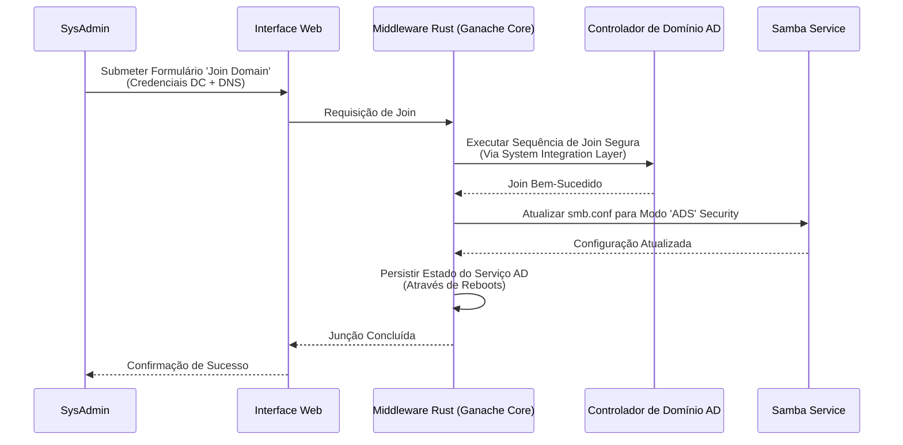

# Diagrama de Sequência de Junção ao Domínio Active Directory

```mermaid
sequenceDiagram
    participant U as SysAdmin
    participant UI as Interface Web
    participant MW as Middleware Rust (Ganache Core)
    participant AD as Controlador de Domínio AD
    participant SMB as Samba Service

    U->>UI: Submeter Formulário 'Join Domain'<br/>(Credenciais DC + DNS)
    UI->>MW: Requisição de Join
    MW->>AD: Executar Sequência de Join Segura<br/>(Via System Integration Layer)
    AD-->>MW: Join Bem-Sucedido
    MW->>SMB: Atualizar smb.conf para Modo 'ADS' Security
    SMB-->>MW: Configuração Atualizada
    MW->>MW: Persistir Estado do Serviço AD<br/>(Através de Reboots)
    MW-->>UI: Junção Concluída
    UI-->>U: Confirmação de Sucesso
```
