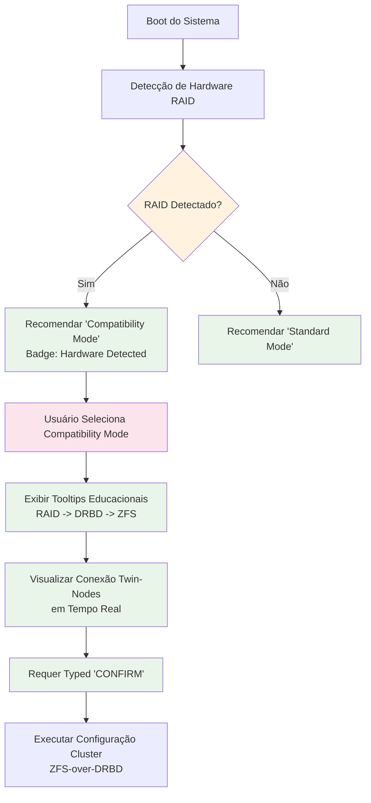

# Fluxograma do Assistente de Instalação (Compatibility Mode)

```mermaid
flowchart TD
    A[Boot do Sistema] --> B[Detecção de Hardware RAID]
    B --> C{RAID Detectado?}
    C -->|Sim| D[Recomendar 'Compatibility Mode'<br/>Badge: Hardware Detected]
    C -->|Não| E[Recomendar 'Standard Mode']
    D --> F[Usuário Seleciona Compatibility Mode]
    F --> G[Exibir Tooltips Educacionais<br/>RAID -> DRBD -> ZFS]
    G --> H[Visualizar Conexão Twin-Nodes<br/>em Tempo Real]
    H --> I[Requer Typed 'CONFIRM']
    I --> J[Executar Configuração Cluster<br/>ZFS-over-DRBD]

    classDef decision fill:#fff3e0
    classDef action fill:#e8f5e8
    classDef user fill:#fce4ec

    class C decision
    class D,E,G,H,I action
    class F user
```
