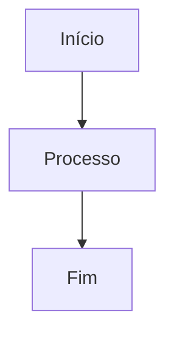

# Padrões de Documentação BMAD

Este guia detalha os padrões obrigatórios para documentação no projeto GANACHE, seguindo o método BMAD (Business Methodology for Agile Documentation). Inclui diretrizes para CommonMark, Mermaid e OpenAPI, com exemplos práticos e sugestões de melhorias baseadas em análises realizadas.

## 1. CommonMark (Markdown)

### 1.1 Sintaxe Básica

CommonMark é o padrão para Markdown usado neste projeto. Todas as documentações devem seguir estas regras:

- **Cabeçalhos**: Use `#` para nível 1, `##` para nível 2, etc. Evite pular níveis (ex: não use `###` sem `##`).

- **Parágrafos**: Separe com linha em branco. Não use espaços extras no final das linhas.

- **Ênfase**: `*itálico*` ou `_itálico_`; `**negrito**` ou `__negrito__`.

- **Listas**:
  - Ordenadas: `1. Item`
  - Não ordenadas: `- Item` ou `* Item`

- **Links**: `[texto](url)` ou `[texto][referência]`

- **Imagens**: ``

- **Blocos de Código**:
  - Inline: `` `código` ``
  - Bloco: `linguagem\ncódigo\n`

- **Citações**: `> Texto`

- **Linhas Horizontais**: `---` ou `***`

### 1.2 Regras de Formatação

- **Linguagem**: Todo o conteúdo deve estar em português brasileiro (pt-BR), exceto código e termos técnicos padronizados.

- **Consistência**: Use títulos descritivos, evite abreviações desnecessárias.

- **Estrutura**: Cada documento deve ter:
  - Cabeçalho nível 1
  - Introdução breve
  - Seções organizadas logicamente
  - Conclusão se aplicável

- **Tabelas**: Use `|` para colunas, `---` para separador de cabeçalho.

Exemplo de tabela:

| Coluna 1 | Coluna 2 |
| -------- | -------- |
| Dado 1   | Dado 2   |

### 1.3 Validação

- Use ferramentas como `markdownlint` para verificar conformidade.
- Evite:
  - Espaços em branco no final das linhas
  - Linhas muito longas (>80 caracteres)
  - Inconsistências em listas

Sugestões de melhoria baseadas em análises:

- Adicione descrições introdutórias em diagramas para maior clareza.
- Inclua links para seções relacionadas no README.

## 2. Mermaid (Diagramas)

### 2.1 Tipos de Diagramas

Mermaid é usado para diagramas visuais integrados em documentos Markdown.

- **Fluxogramas (Flowcharts)**: Para processos e fluxos de dados.
- **Diagramas de Sequência**: Para interações temporais.
- **Diagramas de Classe/Arquitetura**: Para estruturas de sistema.

### 2.2 Sintaxe Básica

- Inicie com ````mermaid`
- Use tipos como `flowchart`, `sequenceDiagram`, `graph`.

Exemplo de fluxograma:



### 2.3 Melhores Práticas para Integração

- **Integração em Documentos**: Coloque diagramas próximos ao texto que descrevem.
- **Legibilidade**: Use cores consistentes (ex: classes CSS).
- **Complexidade**: Mantenha diagramas simples; divida em múltiplos se necessário.
- **Acessibilidade**: Adicione texto alternativo quando possível.

Exemplos práticos aplicáveis:

- **Diagrama de Sistema**: Mostre componentes e conexões (como o diagrama de arquitetura criado).
- **Fluxo de Integração**: Ilustre passos de API ou dados (ex: contrato prime).

Sugestões de melhoria:

- Adicione tooltips ou notas para elementos complexos.
- Use subgráficos para agrupar componentes relacionados.

## 3. OpenAPI (Especificações de API)

### 3.1 Estrutura Básica

OpenAPI define contratos de API REST. No projeto, gera `openapi.json` a partir de código Rust.

- **Versão**: Use OpenAPI 3.0+.
- **Componentes**: paths, schemas, responses.

### 3.2 Exemplos de Esquemas

Exemplo básico:

```yaml
openapi: 3.0.0
info:
  title: Ganache API
  version: 1.0.0
paths:
  /pools:
    get:
      summary: Lista pools ZFS
      responses:
        200:
          description: Sucesso
          content:
            application/json:
              schema:
                type: array
                items:
                  $ref: "#/components/schemas/Pool"
components:
  schemas:
    Pool:
      type: object
      properties:
        name:
          type: string
        size:
          type: integer
```

### 3.3 Conformidade

- **Validação**: Use ferramentas como Swagger Editor.
- **Consistência**: Mantenha schemas alinhados com código Rust.
- **Documentação**: Inclua descrições detalhadas para endpoints.

Exemplos práticos:

- **Esquemas de Pool ZFS**: Defina propriedades como name, size, status.
- **Integração com Frontend**: Geração automática de hooks TypeScript via Orval.

Sugestões de melhoria baseadas em análises:

- Adicione exemplos de requests/responses em documentação.
- Valide schemas contra dados reais para evitar drift.

---

Este guia deve ser seguido rigorosamente para manter a qualidade da documentação no projeto GANACHE.
