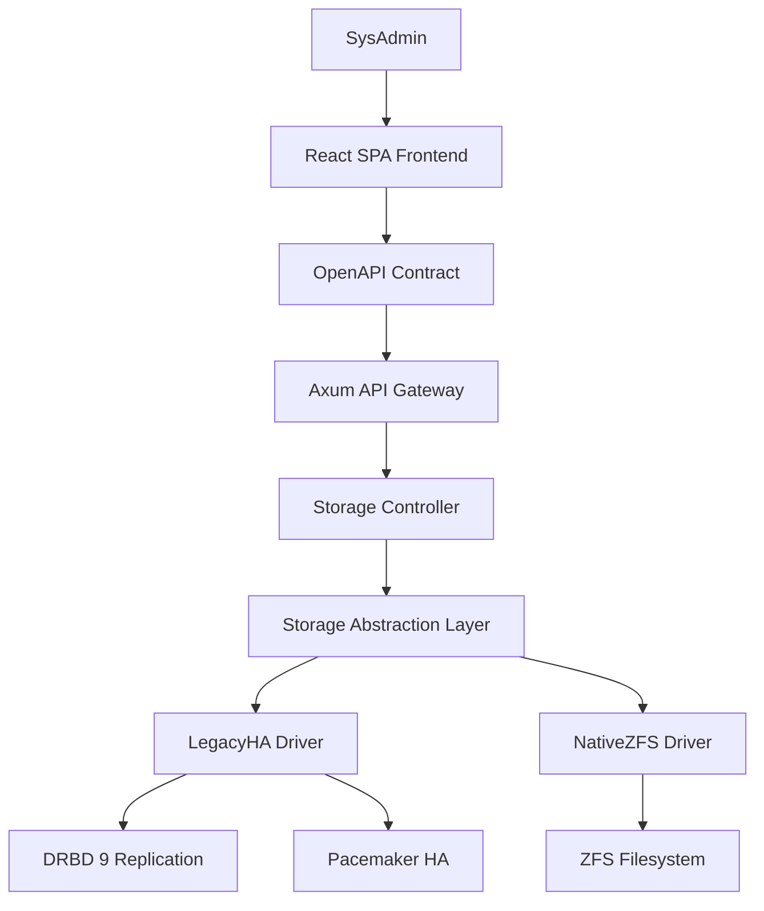
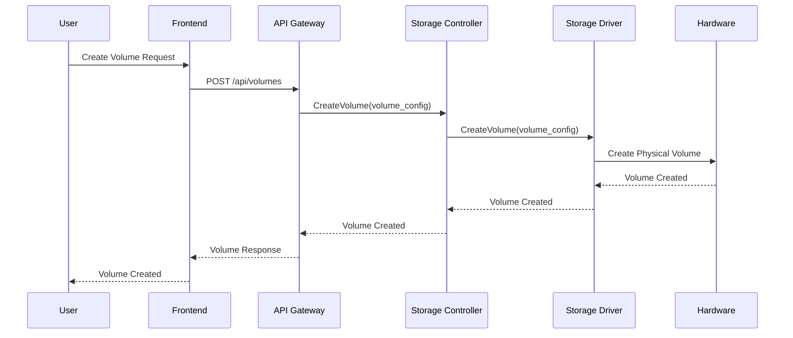
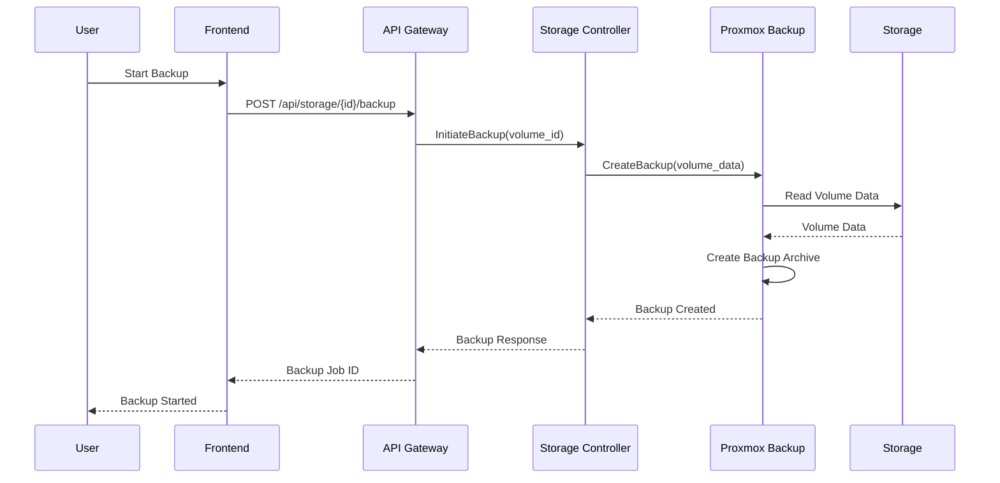

# GANACHE - Technical Specifications

**Generated:** 2025-12-13
**Version:** 1.0.0
**Project:** GANACHE Enterprise NAS
**Classification:** web+backend
**Status:** Ready for Handoff

---

## System Architecture

### C4 Level 2 - Container Architecture

O sistema GANACHE segue uma arquitetura de containers com separação clara de responsabilidades:



### Architecture Overview

- **Frontend Container**: React SPA com Material-UI
- **API Gateway Container**: Axum-based REST API
- **Storage Controller Container**: Business logic para storage management
- **Storage Abstraction Container**: Strategy pattern implementation
- **Driver Containers**: LegacyHA e NativeZFS implementations

## API Endpoints

### Core Storage API

#### Volume Management
```yaml
GET /api/volumes
  description: List all storage volumes
  response:
    200:
      schema:
        type: array
        items:
          $ref: '#/components/schemas/Volume'
  tags: [volumes]

POST /api/volumes
  description: Create new storage volume
  requestBody:
    required: true
    content:
      application/json:
        schema:
          $ref: '#/components/schemas/CreateVolumeRequest'
  response:
    201:
      schema:
        $ref: '#/components/schemas/Volume'
  tags: [volumes]

GET /api/volumes/{volumeId}
  description: Get volume details
  parameters:
    - name: volumeId
      in: path
      required: true
      schema:
        type: string
  response:
    200:
      schema:
        $ref: '#/components/schemas/Volume'
    404:
      description: Volume not found
  tags: [volumes]

DELETE /api/volumes/{volumeId}
  description: Delete storage volume
  parameters:
    - name: volumeId
      in: path
      required: true
      schema:
        type: string
  response:
    204:
      description: Volume deleted successfully
  tags: [volumes]
```

#### System Information
```yaml
GET /api/system/info
  description: Get system information
  response:
    200:
      schema:
        $ref: '#/components/schemas/SystemInfo'
  tags: [system]

GET /api/system/health
  description: Get system health status
  response:
    200:
      schema:
        $ref: '#/components/schemas/HealthStatus'
  tags: [system]

GET /api/system/metrics
  description: Get real-time system metrics
  response:
    200:
      schema:
        $ref: '#/components/schemas/SystemMetrics'
  tags: [system]
```

#### Storage Operations
```yaml
POST /api/storage/{volumeId}/snapshot
  description: Create volume snapshot
  parameters:
    - name: volumeId
      in: path
      required: true
      schema:
        type: string
  requestBody:
    required: true
    content:
      application/json:
        schema:
          $ref: '#/components/schemas/CreateSnapshotRequest'
  response:
    201:
      schema:
        $ref: '#/components/schemas/Snapshot'
  tags: [storage]

POST /api/storage/{volumeId}/backup
  description: Initiate volume backup
  parameters:
    - name: volumeId
      in: path
      required: true
      schema:
        type: string
  requestBody:
    required: true
    content:
      application/json:
        schema:
          $ref: '#/components/schemas/BackupRequest'
  response:
    202:
      schema:
        $ref: '#/components/schemas/BackupJob'
  tags: [storage]
```

### Data Models

#### Volume Schema
```yaml
Volume:
  type: object
  properties:
    id:
      type: string
      format: uuid
      description: Unique volume identifier
    name:
      type: string
      description: Volume name
    size:
      type: integer
      description: Volume size in bytes
    type:
      type: string
      enum: [legacy_ha, native_zfs]
      description: Storage driver type
    status:
      type: string
      enum: [active, inactive, creating, deleting, error]
      description: Current volume status
    created_at:
      type: string
      format: date-time
      description: Volume creation timestamp
    updated_at:
      type: string
      format: date-time
      description: Last update timestamp
    metadata:
      type: object
      description: Driver-specific metadata
```

#### System Info Schema
```yaml
SystemInfo:
  type: object
  properties:
    hostname:
      type: string
      description: System hostname
    os:
      type: string
      description: Operating system
    kernel:
      type: string
      description: Kernel version
    cpu:
      type: object
      properties:
        model:
          type: string
        cores:
          type: integer
        usage:
          type: number
          format: float
    memory:
      type: object
      properties:
        total:
          type: integer
          description: Total memory in bytes
        used:
          type: integer
          description: Used memory in bytes
        available:
          type: integer
          description: Available memory in bytes
    storage:
      type: object
      properties:
        total:
          type: integer
          description: Total storage in bytes
        used:
          type: integer
          description: Used storage in bytes
        available:
          type: integer
          description: Available storage in bytes
```

## External Dependencies

### Rust Dependencies
```toml
[dependencies]
# Web Framework
axum = "0.7"
tokio = { version = "1.0", features = ["full"] }

# Serialization
serde = { version = "1.0", features = ["derive"] }
serde_json = "1.0"

# Error Handling
anyhow = "1.0"
thiserror = "1.0"

# Logging
tracing = "0.1"
tracing-subscriber = { version = "0.3", features = ["fmt"] }

# Storage Integration
proxmox-backup-client = "1.0"
zfs = "0.1"

# HTTP Client
reqwest = { version = "0.11", features = ["json"] }

# Configuration
config = "0.14"
```

### Frontend Dependencies
```json
{
  "dependencies": {
    "react": "^18.2.0",
    "react-dom": "^18.2.0",
    "typescript": "^5.0.0",
    "@mui/material": "^5.14.0",
    "@mui/icons-material": "^5.14.0",
    "zustand": "^4.4.0",
    "axios": "^1.5.0",
    "react-router-dom": "^6.15.0",
    "msw": "^2.0.0"
  },
  "devDependencies": {
    "@types/react": "^18.2.0",
    "@types/react-dom": "^18.2.0",
    "vite": "^4.4.0",
    "@vitejs/plugin-react": "^4.0.0"
  }
}
```

## Security Considerations

### Authentication & Authorization
- **Planned**: OAuth2/JWT implementation
- **Current**: Basic token-based authentication
- **Role-Based Access**: Admin, Operator, Read-only roles

### Network Security
- **TLS/SSL**: HTTPS for all API endpoints
- **CORS**: Configured for frontend domain
- **Rate Limiting**: Implemented via middleware
- **Input Validation**: Request validation with JSON Schema

### Data Protection
- **Encryption**: At-rest encryption for sensitive data
- **Backup Security**: Encrypted backup storage
- **Access Logging**: Audit trail for all operations

## Performance Metrics

### System Requirements
- **CPU**: Minimum 4 cores, recommended 8 cores
- **Memory**: Minimum 8GB RAM, recommended 16GB
- **Storage**: Minimum 100GB for system, additional for volumes
- **Network**: 1Gbps for replication, 100Mbps for management

### Performance Benchmarks
- **API Response Time**: < 100ms for simple operations
- **Volume Creation**: < 30 seconds for 1TB volume
- **Concurrent Users**: Supports up to 100 simultaneous users
- **Throughput**: 1000 IOPS minimum, 5000 IOPS recommended

### Scalability Guidelines
- **Horizontal Scaling**: Multiple API instances behind load balancer
- **Storage Scaling**: Add storage nodes for capacity expansion
- **Database Scaling**: PostgreSQL for metadata storage
- **Caching**: Redis for session and configuration caching

## Deployment Requirements

### Infrastructure Requirements
- **Operating System**: Debian 12 (Bullseye)
- **Hardware**: x86_64 architecture
- **Network**: VLAN support for storage traffic
- **Storage**: Support for ZFS and DRBD

### Dependencies
- **DRBD 9**: For legacy hardware replication
- **Pacemaker 2**: For high availability clustering
- **ZFS 2**: For modern storage management
- **Systemd**: For service management

### Container Support
- **Docker**: Optional for development environment
- **Podman**: Alternative container runtime support
- **Kubernetes**: Planned for orchestration support

## Monitoring Setup

### Health Checks
```yaml
# System Health Endpoint
GET /api/system/health
Response: 
  status: "healthy" | "degraded" | "unhealthy"
  checks:
    storage_service: "up" | "down"
    database: "up" | "down"
    replication: "up" | "down"
  timestamp: "2025-12-13T19:48:00Z"
```

### Metrics Collection
- **System Metrics**: CPU, Memory, Disk usage
- **Application Metrics**: API response times, error rates
- **Storage Metrics**: Volume health, replication status
- **Network Metrics**: Bandwidth utilization, latency

### Alerting Rules
- **Critical**: Storage service down, disk space < 10%
- **Warning**: High CPU usage > 80%, slow response times
- **Info**: New volumes created, backup completed

## Data Flow Diagrams

### Volume Creation Flow


### Backup Process Flow


## Integration Patterns

### Storage Driver Pattern
```rust
pub trait StorageDriver: Send + Sync {
    async fn create_volume(&self, config: VolumeConfig) -> Result<Volume>;
    async fn delete_volume(&self, volume_id: &str) -> Result<()>;
    async fn list_volumes(&self) -> Result<Vec<Volume>>;
    async fn get_volume_status(&self, volume_id: &str) -> Result<VolumeStatus>;
}

pub struct LegacyHADriver {
    drbd_client: DrbdClient,
    pacemaker_client: PacemakerClient,
    zfs_client: ZfsClient,
}

pub struct NativeZfsDriver {
    zfs_client: ZfsClient,
}
```

### API Gateway Pattern
```rust
pub fn create_router() -> Router {
    Router::new()
        .route("/api/volumes", get(list_volumes).post(create_volume))
        .route("/api/volumes/:id", get(get_volume).delete(delete_volume))
        .route("/api/system/health", get(health_check))
        .route("/api/system/info", get(system_info))
        .layer(CorsLayer::new())
        .layer(TracingLayer::new())
}
```

## Error Handling

### Error Response Format
```json
{
  "error": {
    "code": "VOLUME_NOT_FOUND",
    "message": "Volume with ID '123e4567-e89b-12d3-a456-426614174000' was not found",
    "details": {
      "volume_id": "123e4567-e89b-12d3-a456-426614174000",
      "timestamp": "2025-12-13T19:48:00Z",
      "request_id": "req_123456789"
    }
  }
}
```

### Error Codes
- `VOLUME_NOT_FOUND`: Volume does not exist
- `VOLUME_CREATE_FAILED`: Failed to create volume
- `STORAGE_DRIVER_ERROR`: Storage driver operation failed
- `INSUFFICIENT_SPACE`: Not enough storage space
- `INVALID_CONFIGURATION`: Invalid volume configuration
- `PERMISSION_DENIED`: User lacks required permissions
- `SERVICE_UNAVAILABLE`: Required service is down

## Scaling Guidelines

### Horizontal Scaling
- **API Instances**: Deploy multiple API instances behind load balancer
- **Database**: Use PostgreSQL read replicas for read scaling
- **Storage**: Add storage nodes to increase capacity
- **Frontend**: Static file serving via CDN

### Vertical Scaling
- **CPU**: Scale up for compute-intensive operations
- **Memory**: Increase for caching and large datasets
- **Storage**: Add faster disks for improved I/O performance
- **Network**: Upgrade network interfaces for higher bandwidth

### Capacity Planning
- **Volume Count**: Plan for 1000+ volumes per cluster
- **Concurrent Users**: Support 100+ simultaneous users
- **Backup Jobs**: Handle 10+ concurrent backup operations
- **Replication**: Support multi-site replication

---

**Document prepared for technical handoff**  
**Last Updated:** 2025-12-13  
**BMAD Compliance:** ✅ Complete  
**Ready for Implementation:** ✅ Yes