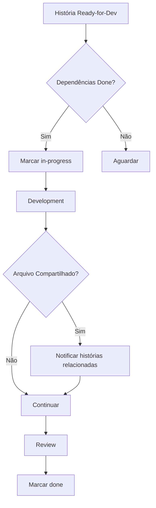

# Framework de Diretrizes de Integração de Histórias (Story 6.2)

## 1. Visão Geral

Este framework define os padrões para integrar múltiplas histórias no projeto GANACHE, com foco específico na prevenção de sobreposição e garantia de consistência arquitetural.

## 2. Análise de Sobreposição (Épico 6)

### 2.1 Histórias Analisadas - Matriz Completa

| História | Status | Componentes Principais | Arquivos Modificados |
|----------|--------|------------------------|----------------------|
| **6.1** | Done | Scripts de review, log parsing Rust | `analyze-review-readiness.sh`, `suggest-fixes.sh`, `security_event_service.rs` |
| **6.2** | Review | Framework de integração | `integration-validator.sh`, `integration-guidelines-framework.md` |
| **6.3** | Backlog | Robustez de parsing | `security_event_service.rs`, funções de parsing |
| **6.4** | Backlog | Testes SSR Next.js | `tests/e2e/`, componentes React SSR |
| **6.5** | Backlog | Guia troubleshooting | `docs/`, documentação de auditoria |
| **6.6** | Backlog | Geração de docs | Scripts de automação, templates |

### 2.2 Áreas de Conflito Identificadas e Mitigações

#### Conflito 1: Log Parsing (6.1 ↔ 6.3)

- **Sobreposição:** História 6.1 já implementou melhorias em `security_event_service.rs` (decode_tty_data, parse_samba_audit_log)
- **Componentes Compartilhados:**
  - `core/ganache-lib/src/security_event_service.rs` - Funções de parsing
  - Tipos `SecurityEvent`, `AuditLogEntry`
- **Mitigação:** História 6.3 deve:
  1. Revisar código de 6.1 ANTES de iniciar
  2. Focar APENAS em casos de borda não cobertos (malformed UTF-8, empty fields)
  3. Adicionar testes para casos específicos novos
  4. **NÃO reescrever** funções já robustas de 6.1

#### Conflito 2: Scripts de Validação (6.1 ↔ 6.2)

- **Sobreposição:** Proliferação de scripts de validação em `scripts/`
- **Componentes Compartilhados:**
  - `scripts/git-classify.sh` (existente, 6.1)
  - `scripts/integration-validator.sh` (novo, 6.2)
  - `scripts/bmad-validate.sh` (atualizado, 6.2)
- **Mitigação:** Consolidar validações:
  1. `bmad-validate.sh` chama `integration-validator.sh` (já implementado)
  2. Evitar duplicação de lógica entre scripts
  3. Criar biblioteca compartilhada `scripts/lib/validation-common.sh` se necessário

#### Conflito 3: Documentação (6.2 ↔ 6.5 ↔ 6.6)

- **Sobreposição:** Múltiplas histórias tocam documentação
- **Componentes Compartilhados:**
  - `docs/integration-guidelines-framework.md` (6.2)
  - Guia de troubleshooting de auditoria (6.5)
  - Templates de geração automatizada (6.6)
- **Mitigação:**
  1. 6.2 define ESTRUTURA do framework (princípios)
  2. 6.5 adiciona CONTEÚDO específico (troubleshooting auditoria)
  3. 6.6 automatiza GERAÇÃO (extração de docs do código)
  4. Seguir SSoT: docs/ é monolítico, não criar subpastas

#### Conflito 4: Testes Frontend (6.4 ↔ outros)

- **Sobreposição:** História 6.4 adiciona testes SSR que podem afetar CI/CD
- **Componentes Compartilhados:**
  - `.github/workflows/test.yml` (pipeline CI)
  - `tests/e2e/` (estrutura de testes)
- **Mitigação:**
  1. 6.4 deve estender `test.yml` sem quebrar jobs existentes
  2. Usar tags de teste (@ssr) para isolar execução
  3. Coordenar com 6.1 (que também tocou CI com burn-in loops)

## 3. Padrões de Serviços Compartilhados

### 3.1 Princípios

- **Responsabilidade Única:** Cada serviço deve fazer uma coisa bem feita.
- **Contratos Claros:** Todo serviço compartilhado deve ter interface definida (Trait em Rust, Types em TS).
- **Sem Estado Compartilhado:** Evitar estado mutável global.

### 3.2 Exemplos Concretos de Serviços Compartilhados (Épico 6)

#### Exemplo 1: SecurityEventService (6.1 + 6.3)

**Localização:** `core/ganache-lib/src/security_event_service.rs`

**Interface:**

```rust
pub trait SecurityEventParser {
    fn parse_audit_log(&self, raw_log: &str) -> Result<AuditLogEntry, ParseError>;
    fn decode_tty_data(&self, hex_data: &str) -> Result<String, DecodeError>;
}
```

**Uso Compartilhado:**

- História 6.1: Implementou parser básico com tratamento de erros
- História 6.3: Estende com validações de casos de borda (UTF-8 inválido, campos vazios)

**Regra de Integração:** 6.3 DEVE reutilizar tipos e traits de 6.1, apenas adicionando validações extras

#### Exemplo 2: Validation Scripts Library (6.1 + 6.2)

**Localização:** `scripts/lib/validation-common.sh` (a ser criado)

**Interface:**

```bash
# Shared validation functions
check_file_exists() { ... }
validate_yaml_syntax() { ... }
report_error() { ... }
```

**Uso Compartilhado:**

- `git-classify.sh` (6.1) usa para validar arquivos staged
- `integration-validator.sh` (6.2) usa para verificar framework
- `bmad-validate.sh` reutiliza funções em ambos

**Regra de Integração:** Extrair lógica duplicada para biblioteca comum ao detectar repetição

### 3.3 Limites de Responsabilidade

- **Rust Core:** Lógica de negócios, acesso ao sistema, segurança.
- **Frontend:** Visualização e interatividade apenas. NUNCA lógica de negócios crítica.
- **Scripts:** Automação de fluxo de trabalho e verificação.

## 4. Como Usar Estas Diretrizes (Guia Passo-a-Passo)

### 4.1 Antes de Iniciar uma Nova História

**Passo 1: Identificar Dependências**

1. Consultar `docs/sprint-artifacts/sprint-status.yaml` para ver status de outras histórias
2. Usar template `docs/dependency-mapping-template.md` para mapear:
   - Arquivos que outras histórias modificaram
   - Serviços/componentes que você pode reutilizar
   - Histórias que precisam estar `done` antes de iniciar

**Passo 2: Validar com Integration Checker**

```bash
# Executar validação de integração
./scripts/integration-validator.sh

# Se falhar, revisar framework antes de prosseguir
```

**Passo 3: Marcar Dependências no Story File**
Adicionar seção "Dependencies" no arquivo da história:

```markdown
## Dependencies (Story Integration)
- **Blocks:** Lista de histórias que esta bloqueia
- **Blocked By:** Histórias que devem estar concluídas antes
- **Shared Components:** Arquivos/serviços compartilhados
```

### 4.2 Durante o Desenvolvimento

**Checkpoint 1: Após Implementar Componente Compartilhado**

- [ ] Documentar interface/contrato no story file
- [ ] Adicionar `@ref Story-ID` em comentários do código
- [ ] Notificar outras histórias afetadas via comentário de código

**Checkpoint 2: Antes de Commitar Mudanças em Arquivo Compartilhado**

```bash
# Verificar quais histórias tocam este arquivo
grep -r "nome_do_arquivo" docs/sprint-artifacts/*.md
```

**Checkpoint 3: Ao Detectar Conflito**

1. Parar desenvolvimento imediatamente
2. Consultar seção 5.2 (Resolução de Conflitos) deste framework
3. Comunicar via story file ou issue

### 4.3 Antes de Marcar História como `done`

**Validação Final:**

```bash
# 1. Integration validator
./scripts/integration-validator.sh

# 2. BMAD compliance
./scripts/bmad-validate.sh

# 3. Verificar commits limpos
git status --porcelain
```

**Atualizar Documentação:**

- [ ] File List no story file está completo
- [ ] Dev Agent Record documenta serviços compartilhados criados
- [ ] `sprint-status.yaml` reflete status correto

### 4.4 Modelo de Comunicação Entre Histórias

**Via Código:**

```rust
// @ref Story-6.1 - Parser base implementado aqui
// @ref Story-6.3 - Estende com validação UTF-8
pub fn decode_tty_data(hex: &str) -> Result<String, DecodeError> {
    // ...
}
```

**Via Story File:**

```markdown
## Integration Notes
- **Reuses:** SecurityEventParser trait from Story 6.1
- **Extends:** Adds malformed data handling (AC #2)
- **Impacts:** Story 6.5 troubleshooting guide should reference this
```

**Bloqueio Explícito:**

- Não iniciar histórias dependentes até que a "Mãe" esteja `done` ou tenha commits estáveis da funcionalidade necessária

## 5. Processo de Coordenação

### 5.1 Checklist de Integração (Executar Antes de Iniciar História)

**Pre-Development Validation:**

- [ ] Verificar `sprint-status.yaml` - dependências estão `done`?
- [ ] Ler dev notes de histórias relacionadas (via File List)
- [ ] Preencher `dependency-mapping-template.md` para esta história
- [ ] Executar `./scripts/integration-validator.sh`

**Durante Development:**

- [ ] Commitar atomicamente (separar por escopo: backend, frontend, tests, docs)
- [ ] Ao modificar arquivo compartilhado, verificar impact em outras histórias
- [ ] Atualizar story file com Integration Notes ao criar componente reutilizável

**Pre-Review Validation:**

- [ ] Executar testes de regressão completos (`npm test`, `cargo test`)
- [ ] Validar compatibilidade com `project-context.md` (seções 8-10)
- [ ] Rodar `./scripts/bmad-validate.sh` (deve passar GREEN)
- [ ] Zero arquivos uncommitted (`git status` limpo)

### 5.2 Resolução de Conflitos

#### Trigger de Conflito

Executar ao detectar que duas histórias tocam o mesmo arquivo:

```bash
# Identificar histórias que modificam arquivo
grep -r "path/to/file.rs" docs/sprint-artifacts/*.md --files-with-matches

# Verificar status dessas histórias
grep -A 2 "story-id:" docs/sprint-artifacts/sprint-status.yaml
```

#### Protocolo de Resolução

**Nível 1 - Conflito de Arquivo (Baixo Risco):**

1. Rebase diário da branch com `main`
2. Resolver conflitos localmente
3. Testar integração após merge

**Nível 2 - Conflito de Interface/Contrato (Médio Risco):**

1. **PARAR** desenvolvimento imediatamente
2. Revisar código da história conflitante
3. Opções:
   - Reutilizar interface existente (preferido)
   - Propor extensão do contrato via PR
   - Criar abstração superior (Trait/Interface)

**Nível 3 - Conflito de Arquitetura (Alto Risco):**

1. **ESCALAR** para revisão de arquitetura
2. Documentar conflito em issue com label `architecture-review`
3. Aguardar decisão antes de prosseguir

#### Matriz de Priorização

Quando múltiplas histórias competem por recurso:

1. **P0 - Security Fixes** (ex: 6.1 problemas de segurança)
2. **P1 - Features Críticas** (ex: 6.3 robustez de parsing se bloqueando produção)
3. **P2 - Melhorias de Processo** (ex: 6.2 guidelines)
4. **P3 - Documentação** (ex: 6.5, 6.6)

### 5.3 Integração com Sprint Tracking

**Automação via sprint-status.yaml:**

- Histórias com `blocked_by` não podem ser marcadas `in-progress` até dependências serem `done`
- Ao fazer commit em arquivo compartilhado, validar que histórias ativas não quebram

**Workflow:**



## 6. Ferramentas de Suporte

- `scripts/integration-validator.sh`: Verifica a estrutura básica de integração.
- `docs/dependency-mapping-template.md`: Template para mapear dependências antes do desenvolvimento.
