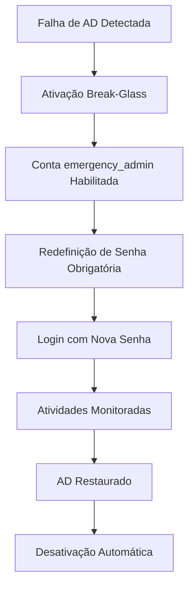

## Contexto Técnico

### Arquitetura

A conta `emergency_admin` deve ser implementada como uma conta local do sistema utilizando o backend Rust (ganache-core daemon), seguindo o modelo de segurança com allow-list sudo em `/etc/sudoers.d/ganache`. As operações críticas são validadas pelo daemon Rust antes de execução shell. A API utiliza contratos OpenAPI definidos em ganache-api para integração type-safe com o frontend Next.js.

Características principais:

- **Isolamento**: Conta local independente do Active Directory
- **Segurança**: Senha criptografada com hash forte (SHA-512), validação via Tipos Serde no backend
- **Auditoria**: Todas as ações registradas no audit log com nível máximo, integrando com sistema de logging existente
- **Integração**: Deve se integrar com os sistemas existentes:
  - História 5.1: Deep SSH Audit Logging (para registro de atividades)
  - História 5.2: Visual Audit Manager (para visualização de eventos)
  - História 5.4: Dashboard de Monitoramento (para alertas e status)

### Componentes Principais

1. **Módulo de Ativação**: Gerencia a ativação/desativação da conta
2. **Módulo de Notificação**: Envia alertas para canais configurados
3. **Módulo de Auditoria**: Registra todas as atividades da conta
4. **Módulo de Segurança**: Gerencia redefinição de senha e complexidade

### Fluxo de Trabalho



### Requisitos de Conformidade

- **HIPAA**: Atender requisitos para acesso de emergência
- **ISO 27001**: Manter rastreabilidade completa
- **NIST**: Senhas com complexidade adequada

# História 5.3: Break-Glass Emergency Admin

## Visão Geral

**Como** CIO/Diretor de TI,
**Eu quero** uma conta de administrador local segura que normalmente esteja desativada, mas possa ser ativada se o Active Directory estiver inacessível,
**Para que** nunca fiquemos bloqueados do nosso próprio sistema de armazenamento durante um desastre.

## Critérios de Aceitação

### AC 5.3.1: Ativação Segura da Conta Break-Glass

**Dado** que o controlador AD está inacessível,
**Quando** um administrador dispara a ativação "Break-Glass" (console física ou URL secreta específica),
**Então** o sistema deve habilitar a conta local `emergency_admin`,
**E** forçar a redefinição de senha no primeiro login,
**E** enviar um alerta crítico de "Alta Prioridade" para todos os canais de notificação configurados (Email/SMS),
**E** registrar firmemente quem disparou a ativação.

### AC 5.3.2: Segurança da Conta Break-Glass

**Dado** que a conta `emergency_admin` está habilitada,
**Quando** um administrador tenta fazer login,
**Então** o sistema deve exigir a redefinição de senha antes de permitir o acesso,
**E** a senha deve atender aos requisitos de complexidade (mínimo 12 caracteres, maiúsculas, minúsculas, números, símbolos),
**E** o login deve ser registrado no audit log com nível de segurança máximo.

### AC 5.3.3: Monitoramento e Alertas

**Dado** que a conta `emergency_admin` foi ativada,
**Quando** ocorre qualquer atividade relacionada à conta,
**Então** o sistema deve gerar alertas em tempo real para todos os administradores configurados,
**E** registrar todas as ações em um log separado de segurança de emergência,
**E** exibir status de alerta no dashboard de segurança.

### AC 5.3.4: Desativação Automática

**Dado** que o controlador AD está novamente acessível,
**Quando** a conta `emergency_admin` foi usada,
**Então** o sistema deve oferecer a opção de desativar automaticamente a conta,
**E** gerar um relatório de auditoria completo da sessão de emergência,
**E** notificar todos os administradores sobre a restauração do serviço normal.

## Requisitos Técnicos

### Segurança

- Conta `emergency_admin` deve ser criada durante a instalação, mas desativada por padrão
- Ativação deve exigir autenticação física ou acesso a URL secreta protegida
- Todas as ações da conta devem ser auditadas com nível máximo de detalhe
- Senha deve ser forçada a mudança no primeiro uso

### Integração

- Deve integrar-se com o sistema de notificação existente (Email/SMS)
- Deve registrar eventos no mesmo audit log usado pelas histórias 5.1 e 5.2
- Deve ser compatível com o dashboard de monitoramento da história 5.4

### Conformidade

- Atender requisitos HIPAA para acesso de emergência
- Manter rastreabilidade completa de quem ativou e usou a conta
- Gerar relatórios de auditoria para auditorias regulatórias

## Dependências

- **História 5.1**: Deep SSH Audit Logging (para registro de atividades)
- **História 5.2**: Visual Audit Manager (para visualização de eventos)
- **História 5.4**: Dashboard de Monitoramento (para alertas e status)

## Riscos e Mitigações

### Risco: Abuso da conta de emergência

**Mitigação**: Registro obrigatório de quem dispara a ativação, alertas em tempo real, auditoria detalhada

### Risco: Esquecimento de desativar a conta

**Mitigação**: Alertas periódicos, opção de desativação automática quando AD estiver disponível

### Risco: Falha na detecção de disponibilidade do AD

**Mitigação**: Implementar múltiplos métodos de verificação (DNS, LDAP, Kerberos)

## Definição de Pronto (DoD)

- [ ] Conta `emergency_admin` criada e desativada por padrão
- [ ] Mecanismo de ativação seguro implementado (console física + URL secreta)
- [ ] Sistema de notificação integrado e testado
- [ ] Auditoria completa de todas as ações da conta
- [ ] Integração com dashboard de segurança
- [ ] Testes de recuperação de desastre validados
- [ ] Documentação de procedimentos de emergência criada
- [ ] Testes de conformidade HIPAA aprovados

## Testes de Aceitação

### Teste 1: Ativação em Falha de AD

1. Simular falha do controlador AD
2. Disparar ativação via console física
3. Verificar habilitação da conta `emergency_admin`
4. Verificar alerta de alta prioridade enviado
5. Verificar registro no audit log

### Teste 2: Login e Redefinição de Senha

1. Tentar login com conta `emergency_admin`
2. Verificar exigência de redefinição de senha
3. Verificar requisitos de complexidade
4. Verificar auditoria da atividade

### Teste 3: Monitoramento e Alertas

1. Ativar conta de emergência
2. Realizar atividades administrativas
3. Verificar alertas em tempo real
4. Verificar registro no dashboard de segurança

### Teste 4: Desativação e Recuperação

1. Restaurar conectividade com AD
2. Desativar conta de emergência
3. Gerar relatório de auditoria
4. Verificar notificação de restauração

## Tasks/Subtasks

### 🔐 Tarefa 5.3.1: Implementar Conta emergency_admin

**Status**: backlog
**Prioridade**: P1
**Estimativa**: 5 story points

**Subtarefas**:

- [ ] Criar conta local `emergency_admin` durante instalação
- [ ] Configurar conta como desativada por padrão
- [ ] Implementar mecanismo de ativação via console física
- [ ] Implementar mecanismo de ativação via URL secreta
- [ ] Configurar registro de auditoria para ativação

**Dev Notes**:

```bash
# Criar conta durante instalação
useradd -r -s /bin/bash -d /home/emergency_admin -c "Emergency Admin" emergency_admin
passwd -l emergency_admin  # Desativar conta
```

### 🔔 Tarefa 5.3.2: Sistema de Notificação e Alertas

**Status**: backlog
**Prioridade**: P1
**Estimativa**: 3 story points

**Subtarefas**:

- [ ] Integrar com sistema de notificação (Email/SMS)
- [ ] Implementar alerta de "Alta Prioridade" para ativação
- [ ] Configurar notificações para todas as atividades da conta
- [ ] Implementar registro no dashboard de segurança

**Dev Notes**:

```typescript
// Exemplo de integração com sistema de notificação
interface EmergencyAlert {
  type: 'emergency_admin_activation';
  severity: 'critical';
  timestamp: string;
  triggered_by: string;
}
```

### 🔄 Tarefa 5.3.3: Redefinição de Senha e Segurança

**Status**: backlog
**Prioridade**: P1
**Estimativa**: 3 story points

**Subtarefas**:

- [ ] Implementar redefinição de senha no primeiro login
- [ ] Validar complexidade da senha (12+ caracteres)
- [ ] Configurar registro de auditoria para login
- [ ] Implementar desativação automática quando AD disponível

**Dev Notes**:

```bash
# Forçar redefinição de senha no primeiro login
chage -d 0 emergency_admin
```

### 📊 Tarefa 5.3.4: Monitoramento e Relatórios

**Status**: backlog
**Prioridade**: P2
**Estimativa**: 2 story points

**Subtarefas**:

- [ ] Implementar log separado de segurança de emergência
- [ ] Gerar relatório de auditoria completo
- [ ] Integrar com dashboard de monitoramento
- [ ] Implementar alertas em tempo real

**Dev Notes**:

```typescript
// Estrutura de log de emergência
interface EmergencyLog {
  action: string;
  user: string;
  timestamp: string;
  ip_address: string;
  severity: 'high' | 'critical';
}
```

## Referência de Contexto

- **Epic**: [Epic 5: Compliance Shield](docs/epics.md#epic-5-compliance-shield)
- **Dependências**: Histórias 5.1, 5.2, 5.4
- **Arquitetura**: [docs/architecture.md](docs/architecture.md)
- **UX Design**: [docs/ux-design-specification.md](docs/ux-design-specification.md)
