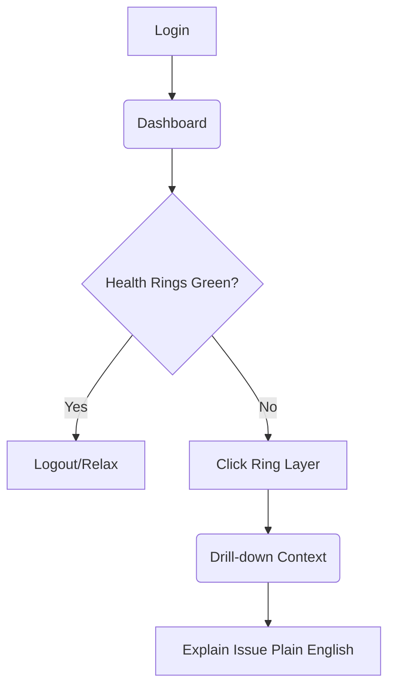

# UX Design Specification GANACHE

**Author:** Helton
**Date:** 2025-12-16

---

<!-- UX design content will be appended sequentially through collaborative workflow steps -->

## Executive Summary

### Project Vision

Transform legacy hardware (e.g., Dell PE 2950 with HW RAID) into a reliable High-Availability Storage Appliance. Ganache NAS solves the "ZFS on HW RAID" paradox using a "Pragmatic Architecture" (ZFS over DRBD over HW RAID), prioritizing safety, transparency, and simplicity for the administrator.

### Target Users

System Administrators (often juniors or generalists) tasked with repurposing existing infrastructure. They value data safety above all and require a system that acts as a "Guide" and provides "Safety Gates" to prevent misconfiguration, reducing anxiety around complex technical choices.

### Key Design Challenges

1. **Explaining Complexity:** Communicating the safety and rationale of the non-standard architecture to build trust.
2. **Critical Decision Tree:** guiding users unambiguously between *Standalone* and *Cluster* (Primary/Secondary) modes.
3. **Error Prevention (Safety Gates):** Translating hardware constraints into helpful, educational feedback rather than blocking errors.

### Design Opportunities

1. **The "Educator Wizard":** A configuration flow that explains *why* recommendations are made.
2. **Safety Visualization:** Graphically displaying the protection layers (RAID + DRBD) to reassure the user.

## Core User Experience

### Defining Experience

The most critical interaction is the **"Guided Setup Wizard"** for storage layers. It is the moment where the user *feels* the safety of the architecture. If we fail here, they won't trust their data. The experience must be one of **education, not just configuration**.

### Platform Strategy

* **Primary:** Responsive Web Interface (Desktop First for heavy administration).
* **Secondary:** "Read-Only" friendly Mobile Dashboard (for quick health checks/alerts in the middle of the night).

### Effortless Interactions

* **Role Discovery:** The system should tell the user if they should be Primary or Secondary based on network visibility, or ask in a simple binary way.
* **Safe Pool Creation:** The "Create ZPool" button should only light up when all layers (RAID -> DRBD -> LVM) are green. The user shouldn't have to "guess" if they are ready.

### Critical Success Moments

1. **The Final "Green Check":** Seeing the "Healthy" status after Cluster setup. It's the moment of relief.
2. **The Positive "Safety Gate":** When the system blocks a dangerous action (e.g., creating Zpool directly on RAID) and explains why, the user should feel *protected*, not blocked.

### Experience Principles

1. **Radical Transparency:** No "black boxes". Explain the magic of DRBD/ZFS.
2. **Safety by Design:** The interface prohibits errors before they happen.
3. **The Admin is the Pilot, the System is the Co-Pilot:** We suggest and verify, the user confirms.

## Desired Emotional Response

### Primary Emotional Goals

**Relief and Confidence.** The admin arrives anxious (legacy hardware, fear of data loss) and should leave feeling like a hero ("I saved the company using old servers safely").

### Emotional Journey Mapping

1. **Discovery:** Skepticism ("Will ZFS really run on this?").
2. **Configuration:** Curiosity ("Why is it recommending this?") -> Comprehension ("Oh, I understand the security layer!")
3. **Conclusion (Green Check):** **Relief.** The physical sensation of lowering one's shoulders. The certainty that "it works and won't break".

### Micro-Emotions

* **Trust:** Earned when the system explains *why* it blocked an error, rather than just saying "Failure".
* **Empowerment:** The junior admin feels senior because the system taught them about HA/DRBD during the process.

### Design Implications

* **Calming Color Palette:** Avoid excessive reds in non-critical alerts. Use greens and blues that convey stability.
* **Partner Language:** Use "We recommend" instead of "You must".
* **Visual Confirmation:** Subtle animations (micro-interactions) when completing complex tasks to reinforce success.

### Emotional Design Principles

1. **Empathy First:** Understand the user's anxiety and design to alleviate it.
2. **Celebration of Success:** Make the "Green Check" feel like a victory.
3. **Educational Tone:** Build confidence through knowledge sharing.

## UX Pattern Analysis & Inspiration

### Inspiring Products Analysis

1. **TrueNAS Scale:** Reference for ZFS functionality, but complex.
    * *Inspiration:* Rich Dashboard.
2. **Proxmox VE:** Native ecosystem.
    * *Inspiration:* "Tree-view" of resources and UI sobriety.
3. **Synology DSM:** Gold standard for "ease of use" in NAS.
    * *Inspiration:* Visual "Storage Manager" showing which disks are in which slots.

### Transferable UX Patterns

* **Linear Setup Wizard:** (Inspiration: Modern Linux Installers) - One step at a time, no cognitive overload.
* **Health Rings:** (Inspiration: Apple Fitness) - Colored rings to visually indicate DRBD/ZFS health at a glance.
* **Contextual Help:** (Inspiration: VS Code) - Rich hover tips explaining technical terms in context.

### Anti-Patterns to Avoid

* **Cryptic "Error Codes":** Avoid showing only "Error 0x8021". Translate to "Disk 2 disconnected".
* **"Hidden" Settings in Context Menus:** Critical actions must be visible or on clear buttons, not hidden in right-clicks.
* **Alert Fatigue:** Don't email for every successful ZFS scrub. Only for failures or degradation.

### Design Inspiration Strategy

* **Adopt:** TrueNAS's "Storage Pool" mental model.
* **Adapt:** Synology's visual simplicity for our "Setup Wizard".
* **Avoid:** Proxmox's excessive network complexity for the end user of Ganache.

## Design System Foundation

### 1.1 Design System Choice

**Tailwind CSS + Shadcn UI (Reusable Components)**

### Rationale for Selection

1. **Incredible Speed:** Shadcn provides ready-made components (Accordions, Alerts, Cards) that look premium by default.
2. **Full Control:** It's not an NPM dependency; code is copied into the project, allowing deep customization without fighting a library.
3. **Modernity:** Industry standard for modern React, ensuring maintainability.

### Implementation Approach

* Install base Shadcn UI.
* Create a `theme.css` with "Calming Blue" and "Success Green" variables.
* Customize the `Progress` component implementation for "Health Rings".

### Customization Strategy

* **Don't Reinvent:** Use standard `Select`, `Input`, and `Button`.
* **Invest in Gold:** Build custom components only for unique widgets like "Zpool Status" and "DRBD Replication".

## 2. Core User Experience

### 2.1 Defining Experience

The defining experience is the creation of a **"Safe Cluster"** (ZFS Pool over DRBD). It's the "Aha!" moment where the user realizes they've turned two "dumb" servers into an intelligent, resilient storage cluster.

### 2.2 User Mental Model

* **Current:** "RAID is safe but dumb. ZFS is smart but dangerous on my hardware RAID."
* **New (Ganache):** "I have the best of both worlds. Ganache manages the complexity."
* **Expectation:** "I just say 'I want a safe pool' and the system handles the details (DRBD, LVM, ZFS configuration)."

### 2.3 Success Criteria

1. **Zero CLI:** The user must never need to open the terminal to create the cluster.
2. **Visual Confirmation:** Seeing the two "towers" (servers) connecting and turning green.
3. **Setup Time:** Less than 5 minutes from boot to active pool.

### 2.4 Novel UX Patterns

* **Novel: "Twin-View Topology"** - Visualizing the two servers side-by-side on the setup screen, showing the "live" replication link between them.
* **Established: Setup Wizard** - Standard linear flow (1. Choose Disks -> 2. Define Network -> 3. Confirm).

### 2.5 Experience Mechanics

1. **Initiation:** "Create Trust Cluster" button on the Dashboard.
2. **Interaction (Twin-View):**
    * Drag disks from "Node A" and "Node B" to the center.
    * System validates if they are identical (size/type).
    * Immediate Feedback: "Matching Pair Detected".
3. **Feedback:** Double progress bar (Sync Node A <-> Sync Node B).
4. **Completion:** "Link Closed" animation and subtle confetti. Status changes to "Healthy".

## Visual Design Foundation

### Color System

**The "Safety Palette" (Tranquility & Trust)**

* **Primary:** `Slate Blue` (#0F172A) - Deep, technical, solid.
* **Success:** `Emerald` (#10B981) - Vibrant but not shouting.
* **Warning:** `Amber` (#F59E0B) - Visible, but not alarming.
* **Error:** `Rose` (#F43F5E) - Reserved only for actual disk/hardware failures.
* **Backgrounds:** Cool grays (`slate-50` to `slate-900` in dark mode).

### Typography System

* **Headings:** `Inter` (Bold/Black) - Clean, modern, extreme legibility.
* **Body/UI:** `Inter` (Regular/Medium) - The modern web standard.
* **Code/Logs:** `JetBrains Mono` - For IPs, UUIDs, and ZFS logs. Essential for data tabular alignment.

### Spacing & Layout Foundation

* **Density:** "Comfortable". We advocate for airiness to reduce cognitive load while reading status.
* **Density:** "Comfortable". We advocate for airiness to reduce cognitive load while reading status.
* **Cards:** Extensive use of Cards with subtle borders to group contexts (e.g., "Node A" card, "Node B" card).
* **Grid:** Fluid 12-column layout adapting from ultrawide (NOC dashboard) to tablet (couch admin).

### Accessibility Considerations

* **Contrast:** All text on "Slate" backgrounds must pass WCAG AA.
* **Color Independence:** Health Rings will use both Color AND Position/Icon to indicate status, never color alone.

## Design Direction Decision

### Design Directions Explored

1. **Ganache SAFE (Default):** Base "Calming Blue" + "Success Green". Perfect balance of professional tool and ease of use.
2. **Ganache DARK OPS:** "Hacker" style. High contrast, deep blacks, neon greens. Ideal for dark environments (NOCs).
3. **Ganache LIGHT:** "Classic Enterprise" style. White, gray, corporate blue. Safe but soulless.

### Chosen Direction

**Option 1: Ganache SAFE (with Dark Mode support)**

### Design Rationale

* **Emotional Alignment:** The "Safe" mode communicates exactly the emotion defined in Step 4: *Tranquility*.
* **Emotional Alignment:** The "Safe" mode communicates exactly the emotion defined in Step 4: *Tranquility*.
* **Visual Hierarchy:** The use of subtle shadows (Shadcn style) in Safe mode creates depth that helps understand hierarchy (Disks "inside" the Node).
* **Flexibility:** "Dark Ops" is excellent but potentially tiring for long setup sessions; it will serve as our optional Dark Mode.

### Implementation Approach

* **Theme Tokens:** Implement `light` (Safe) and `dark` (Dark Ops) variants in Tailwind config.
* **Default:** Ship with `light` mode active by default to maximize approachability for new users.

## User Journey Flows

### Journey 1: Setup ("The Twin-View Flow")

**Goal:** Initialize a High-Availability Cluster from scratch.

```mermaid
graph LR
    A[Dashboard] -->|Click "Create Cluster"| B(Twin-View Setup)
    B -->|Drag Disks| C{Pair Match?}
    C -->|No| B
    C -->|Yes| D[Sync Rings Start]
    D -->|Wait 2-5m| E(Success Confetti)
    E -->|Auto-Redirect| F[Dashboard "Healthy"]
```

**Optimization:** Immediate feedback on drag action. If user drags NVMe to HDD, visual "shake" animation rejects the action.

### Journey 2: Monitoring ("The Morning Coffee")

**Goal:** Verify system health in less than 5 seconds.



**Optimization:** Zero-click insights. Outer ring (DRBD) and inner ring (ZFS) communicate status without interaction.

### Journey 3: Recovery ("The Panic Moment")

**Goal:** Restore service availability during a node failure.

```mermaid
graph TD
    A[Email Alert] -->|Mobile Link| B(Mobile Dashboard)
    B --> C[Card "Node A Failed"]
    C --> D{Button "Promote Node B"?}
    D -->|Click| E[System Promotes Secondary]
    E --> F[Services Restart on Node B]
    F --> G[Alert "Cluster Degraded but Online"]
```

**Optimization:** The "Promote" action must be prominent and explain consequences ("Node A will be marked as 'Outdated'").

### Flow Optimization Principles

1. **Direct Manipulation:** Drag & Drop for "physical" actions (moving disks).
2. **Progressive Disclosure:** Don't show "Sync Rate" MB/s unless the user hovers the progress bar.
3. **Plain English Recovery:** Never ask "Force Primary?", ask "Make this server the active leader?".

## Component Strategy

### Design System Components

**Foundation: Shadcn UI**
We will leverage these ready-made components for 80% of the UI:

* `Dialog/Modal`: For critical confirmations ("Promote Node").
* `Accordion`: For the linear steps of the Setup Wizard.
* `Toast`: For success notifications ("Cluster Created").
* `Badge`: For simple status indicators (Online/Offline).

### Custom Components

We will build these 3 unique components from scratch to deliver the "Gold" experience:

1. **Server Blade Card**
    * **Purpose:** Physically represent a node in the UI.
    * **Content:** Hostname, IP, Disk Slots (Drag & Drop zones), Status LED.
    * **Interaction:** Accepts dragged disks; shakes on invalid drop.

2. **Twin-View Sync Ring**
    * **Purpose:** Visualize the DRBD replication link health.
    * **Anatomy:** Two concentric rings. Outer = DRBD Link Status. Inner = ZFS Pool Status.
    * **State:** Green (Synced), Amber (Resyncing), Red (Broken).

3. **Zpool Topology Tree**
1. **Server Blade Card**
    * **Purpose:** Physically represent a node in the UI.
    * **Content:** Hostname, IP, Disk Slots (Drag & Drop zones), Status LED.
    * **Interaction:** Accepts dragged disks; shakes on invalid drop.

2. **Twin-View Sync Ring**
    * **Purpose:** Visualize the DRBD replication link health.
    * **Anatomy:** Two concentric rings. Outer = DRBD Link Status. Inner = ZFS Pool Status.
    * **State:** Green (Synced), Amber (Resyncing), Red (Broken).

3. **Zpool Topology Tree**
    * **Purpose:** Display the VDEV hierarchy (Pool > Mirror > Disk) on the Dashboard.
    * **Differentiator:** Visual tree structure with "Health Dots" at every leaf node for quick diagnostics.

### Implementation Roadmap

* **Phase 1 (MVP - Setup):** Implement `Server Blade Card` and `Twin-View Sync Ring`. Essential for the "Twin-View Flow".
* **Phase 2 (Dashboard):** Implement `Zpool Topology Tree`. Essential for the "Morning Coffee" monitoring journey.

## UX Consistency Patterns

### Button Hierarchy

* **Primary:** Solid Blue (`bg-slate-900`). Main screen action (e.g., "Save Changes").
* **Danger:** Solid Rose (`bg-rose-600`). Destructive actions with double confirmation (e.g., "Destroy Pool", "Promote Node").
* **Ghost:** Transparent text. Secondary actions (e.g., "Cancel", "Advanced Options").

### Feedback Patterns

* **Success:** `Toast` in bottom right. Disappears in 3s. *Does not block user.*
* **Info:** `Inline Alert` (blue banner) at top of card. *Persists until resolved.*
* **Critical:** `Blocking Modal` (dimmed background). *Requires immediate action (e.g., Split-brain detected).*

### Navigation Patterns

* **Global (Sidebar):** Dashboard, Pools, Network, Settings. (Where am I in the system?)
* **Contextual (Tabs):** Inside a Node -> Disks | Network | Services. (Where am I in the object?)

### Additional Patterns (Empty States)

* **Rule:** Never show an empty table.
* **Action:** Show an illustration (the sad "Chef Ganache" mascot) and a **Primary** button to create the first item ("Add your first Drive").

## Responsive Design & Accessibility

### Responsive Strategy ("The 3AM Rule")

* **Desktop (Setup Mode):** The "Twin-View Topology" is layout-intensive and prioritized for screens > 1024px.
* **Mobile (Panic Mode):** In an emergency (3 AM outage), the UI transforms. "Twin-View" becomes "Stack View". Focus shifts entirely to **Status Reading** and **Recovery Actions**.
  * *Constraint:* Critical buttons (e.g., "Promote Node") must have a touch target > 50px to accommodate clumsy/shaking fingers.

### Breakpoint Strategy

We will follow standard Tailwind breakpoints with semantic mappings:

* `sm` (640px): **Stack View** starts here. (Mobile Panic Mode).
* `lg` (1024px): **Twin-View** becomes available. (Desktop Setup Mode).

### Accessibility Strategy (WCAG AA)

* **Color Independence:** Never rely on color alone. Errors use: Color (Red) + Icon (X) + Text Label.
  * *Essential for Color Blindness users.*
* **Keyboard Navigation:** The Cluster Setup Wizard must be 100% navigable via Tab/Enter/Space.
* **Cognitive Load:** "Dark Ops" mode isn't just cool; it's an accessibility feature for reducing eye strain in low-light datacenter environments.

### Testing Strategy

1. **Real Device Testing:** Verify the "Panic Mode" flow on an actual iPhone/Android device. The "Promote" button must be easily reachable.
2. **Automated Audits:** Use `axe-core` in CI/CD to catch basic WCAG violations.
3. **Keyboard Runs:** Manual pass of the Setup Wizard with no mouse.
